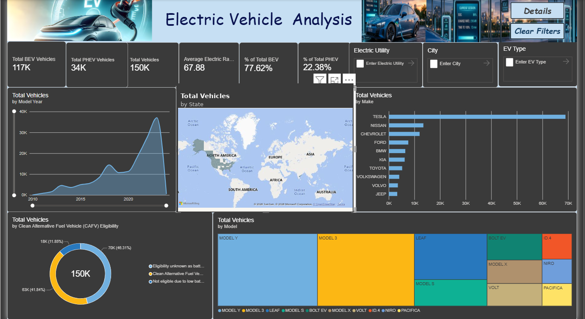

# Electric Vehicle Analysis Dashboard — Power BI

An interactive Power BI dashboard analyzing the Washington State Electric Vehicle (EV) Population dataset — ~150,000 registered vehicle records — to surface adoption trends, manufacturer market share, and clean-fuel incentive eligibility.



## 📌 Project Overview

**Goal:** Turn a raw government CSV export into an interactive, filterable dashboard that answers:
- How large is the EV population, and how fast is it growing?
- What's the split between Battery EVs (BEV) and Plug-in Hybrid EVs (PHEV)?
- Which manufacturers and models lead adoption?
- How many vehicles qualify for Clean Alternative Fuel Vehicle (CAFV) incentives?

**Tool:** Power BI Desktop
**Dataset:** [Washington State DOL — Electric Vehicle Population Data](https://catalog.data.gov/dataset/electric-vehicle-population-data) (~150,458 rows)

## 🗂️ Repository Contents

```
├── EV_Dashboard.pbix              # Power BI project file
├── Electric_Vehicle_Population_Data.csv   # Source dataset
├── README.md                      # This file
└── screenshots/
    ├── dashboard-home.png         # Main dashboard page
    └── dashboard-details.png      # Details/drill-down page
```

## 🧹 Data Preparation (Power Query)

| Step | What was done |
|---|---|
| Data types | Set `Model Year`, `Electric Range`, `Base MSRP` to Whole Number; kept `Postal Code`, `VIN`, `DOL Vehicle ID` as Text |
| Deduplication | Removed duplicate rows using `DOL Vehicle ID` as the unique key |
| Location split | Split `Vehicle Location` (`POINT (-122.34 47.65)`) into separate `Longitude` / `Latitude` columns using `Text.BetweenDelimiters` |
| Utility cleanup | Split `Electric Utility` on the `\|` delimiter, keeping the left-most (primary) utility per row |
| Column cleanup | Renamed and hid unused ID columns from the report view |

## 📐 Data Model

Single flat table — no relationships required. `Model Year` verified as Whole Number for correct chart-axis sorting.

## 🧮 DAX Measures

```DAX
Total Vehicles = COUNTROWS('Electric_Vehicle_Population_Data')

Total BEV Vehicles =
CALCULATE(
    [Total Vehicles],
    'Electric_Vehicle_Population_Data'[EV Type] = "Battery Electric Vehicle (BEV)"
)

Total PHEV Vehicles =
CALCULATE(
    [Total Vehicles],
    'Electric_Vehicle_Population_Data'[EV Type] = "Plug-in Hybrid Electric Vehicle (PHEV)"
)

% of Total BEV = DIVIDE([Total BEV Vehicles], [Total Vehicles])

% of Total PHEV = DIVIDE([Total PHEV Vehicles], [Total Vehicles])

Average Electric Range = AVERAGE('Electric_Vehicle_Population_Data'[Electric Range])
```

## 📊 Visuals & Field Mapping

| Visual | Type | Fields |
|---|---|---|
| KPI Cards (×6) | Card | `Total Vehicles`, `Average Electric Range`, `Total BEV Vehicles`, `% of Total BEV`, `Total PHEV Vehicles`, `% of Total PHEV` |
| Vehicles by Model Year | Line/Area | X: `Model Year` (filtered ≥ 2010) · Y: `Total Vehicles` |
| Vehicles by State | Filled Map | Location: `State` · Tooltip: `Total Vehicles` |
| Top 10 by Make | Clustered Bar | Category: `Make` · Value: `Total Vehicles` · Top N filter = 10 |
| CAFV Eligibility | Donut | Legend: `CAFV Eligibility` · Value: `Total Vehicles` |
| Top 10 by Model | Treemap | Group: `Model` · Value: `Total Vehicles` · Top N filter = 10 |
| Slicers | Dropdown | `City`, `Electric Utility`, `EV Type` |

## 🎨 Design

- Custom green color theme matching the EV/sustainability subject
- Branded header with title and imagery
- Two-page layout: **Home** (summary) and **Details** (row-level table + county/MSRP breakdown)
- `HOME` / `DETAILS` navigation buttons wired via Page Navigation actions
- `Clear Filters` button (Reset action) to instantly clear all slicer selections

## 🔍 Key Insights

- **BEVs dominate** the fleet at 77.6% vs. 22.4% PHEV
- **Tesla leads adoption by a wide margin** — Model Y and Model 3 are the two single largest models in the dataset
- **EV adoption accelerated sharply** in recent years, consistent with expanding model availability and charging infrastructure
- **46% of vehicles qualify** for Clean Alternative Fuel incentives; 42% fall short on the range threshold, directly tying back to the ~68-mile average range KPI

## ⚠️ Limitations

- Dataset is Washington State registrations only — not a national picture
- Reflects a static snapshot at time of export, not a live/refreshing connection

## 🛠️ How to Use

1. Clone this repo
2. Open `EV_Dashboard.pbix` in Power BI Desktop
3. If prompted, update the data source path to point to `Electric_Vehicle_Population_Data.csv` on your machine
4. Interact via the slicers (City, Electric Utility, EV Type) — all visuals cross-filter automatically

## 👤 Author

**Harish B**
Built as an assigned project to practice end-to-end Power BI development — data cleaning, modeling, DAX, visualization, and dashboard UX.
